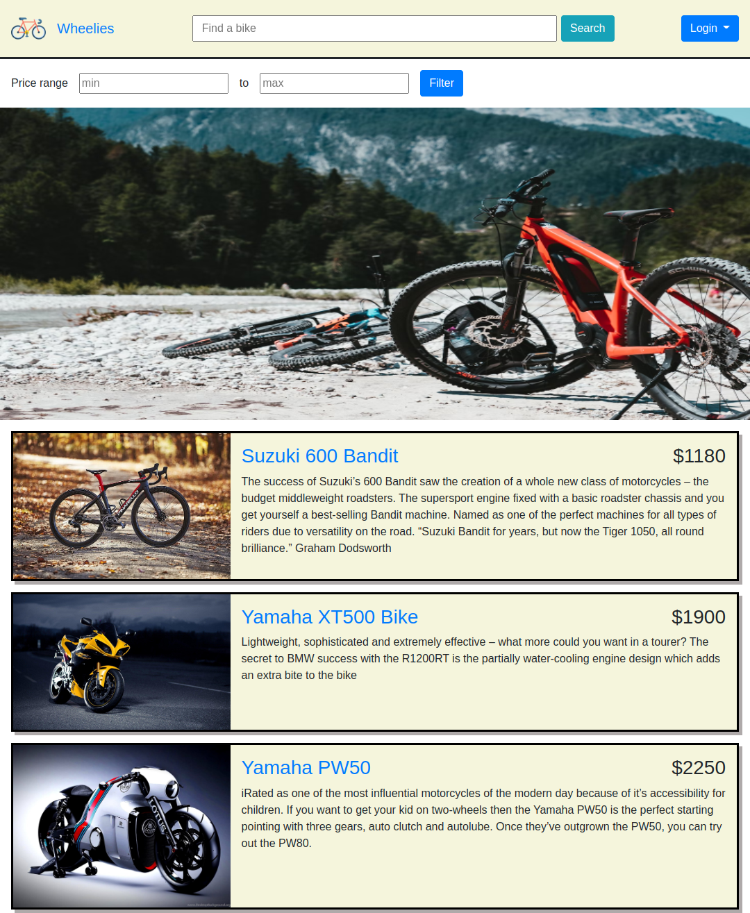
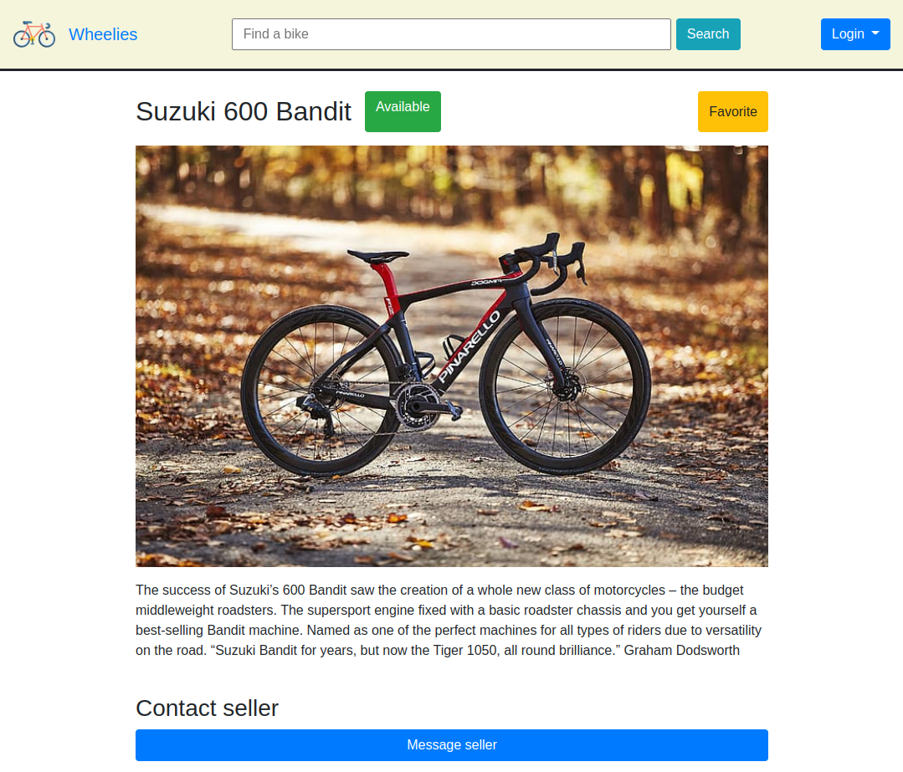
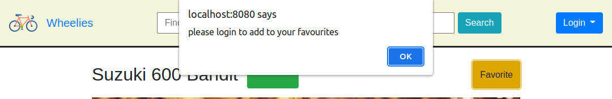
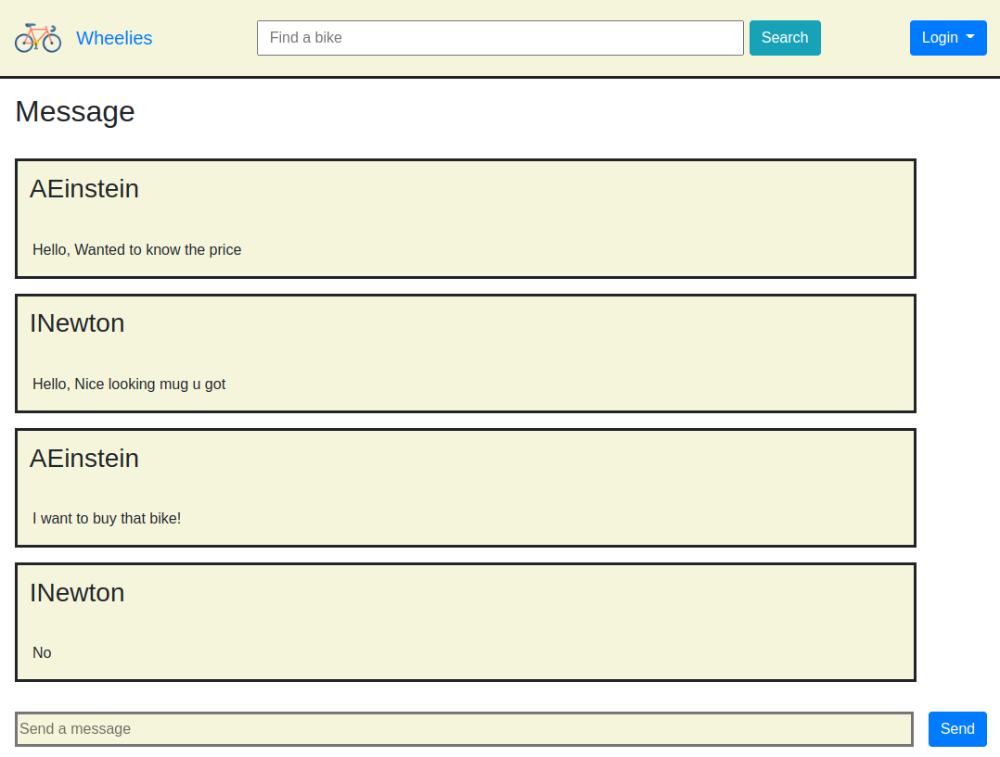
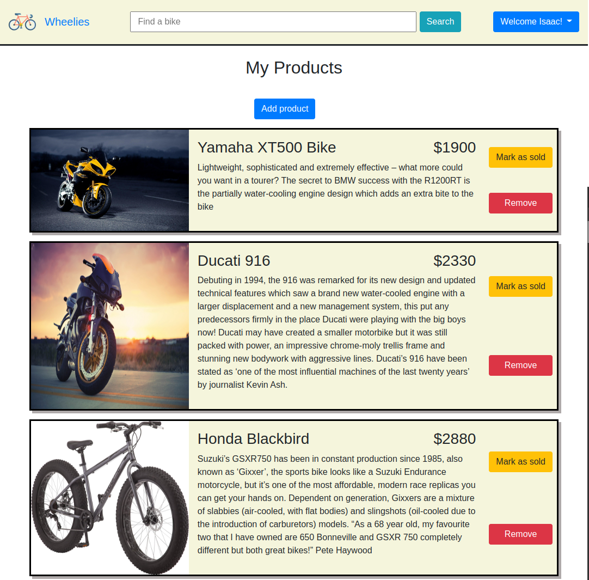
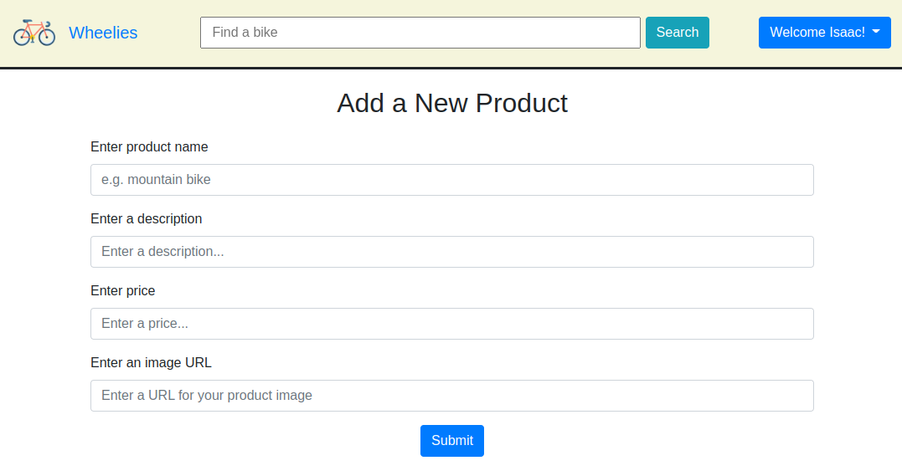
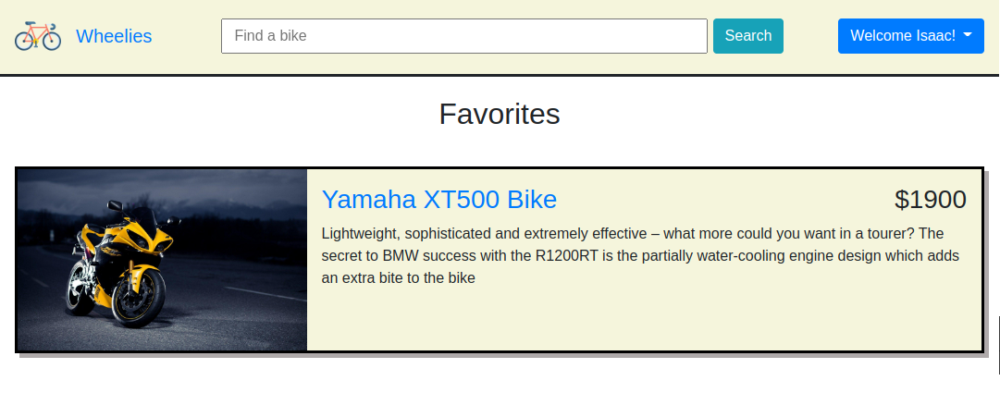
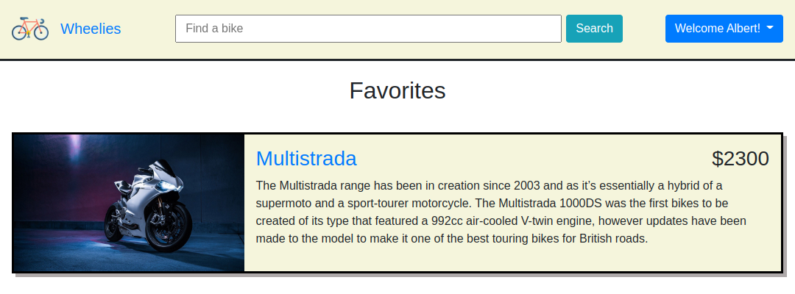
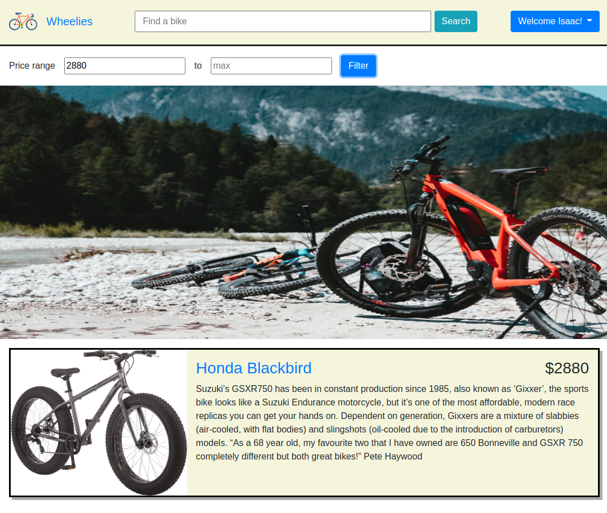

# Buy Sell Listing Website

# Technical Specifications

- Node 10.x or above
- NPM 5.x or above
- PG 6.x
- EJS
- SASS
- Morgan
- Express
- Dotenv
- Chalk

# Screenshots

## Getting Started

1. Create the `.env` by using `.env.example` as a reference: `cp .env.example .env`
2. Update the .env file with your correct local information
   - username: `labber`
   - password: `labber`
   - database: `midterm`
3. Install dependencies: `npm i`
4. Fix to binaries for sass: `npm rebuild node-sass`
5. Reset database: `npm run db:reset`
   - Check the db folder to see what gets created and seeded in the SDB
6. Run the server: `npm run local`
   - Note: nodemon is used, so you should not have to restart your server
7. Visit `http://localhost:8080/`
